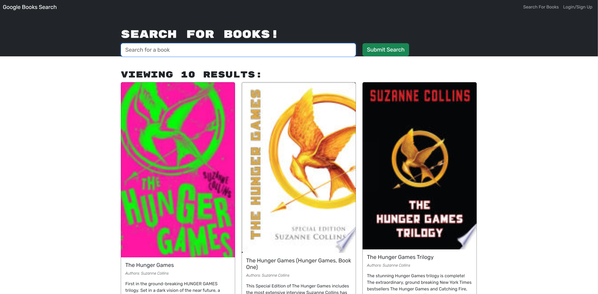
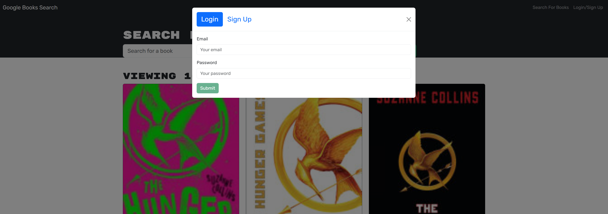

# Book Worm

## Description

A fullstack MERN application utilizing a GraphQl API being ran on an Apollo server. The application allows the user to search their favorite books using the Google Books API and save searched books to a savedBooks list and delete books off that list with the use of an account that they can create.

## Table of Contents

- [Technology](#Technology)
- [Installation](#installation)
- [Usage](#usage)
- [Credits](#credits)
- [License](#license)

## Technology

- JavaScript
- Node.js
- Apollo Server
- MongoDB
- Mongoose
- GraphQl
- Heroku
- bcrypt
- React

## Installation

No installation is requires as the application is a live website. You can access the live site through the deployment link, here:

https://lit-ravine-04263-cb6fbb6a7113.herokuapp.com/
## Usage

`When you open the app you are presented with the homescreen and are able to view books when submitting a search.`

`Clicking the login button prompts the user to either log in or create an account and sign up.`

`Once the user has logged in, They are then able to save books to the 'See Your Books' tab and can proceed to delete books from that list.`

## License

MIT License

Copyright (c) [2023] [CullenKnott]

Permission is hereby granted, free of charge, to any person obtaining a copy of this software and associated documentation files (the "Software"), to deal in the Software without restriction, including without limitation the rights to use, copy, modify, merge, publish, distribute, sublicense, and/or sell copies of the Software, and to permit persons to whom the Software is furnished to do so, subject to the following conditions:

The above copyright notice and this permission notice shall be included in all copies or substantial portions of the Software.